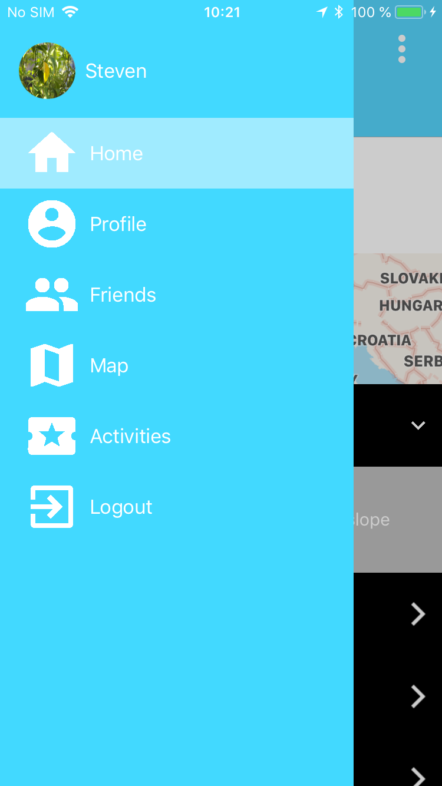
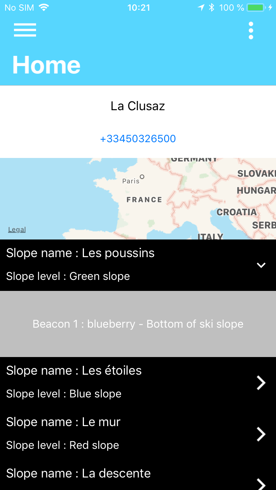
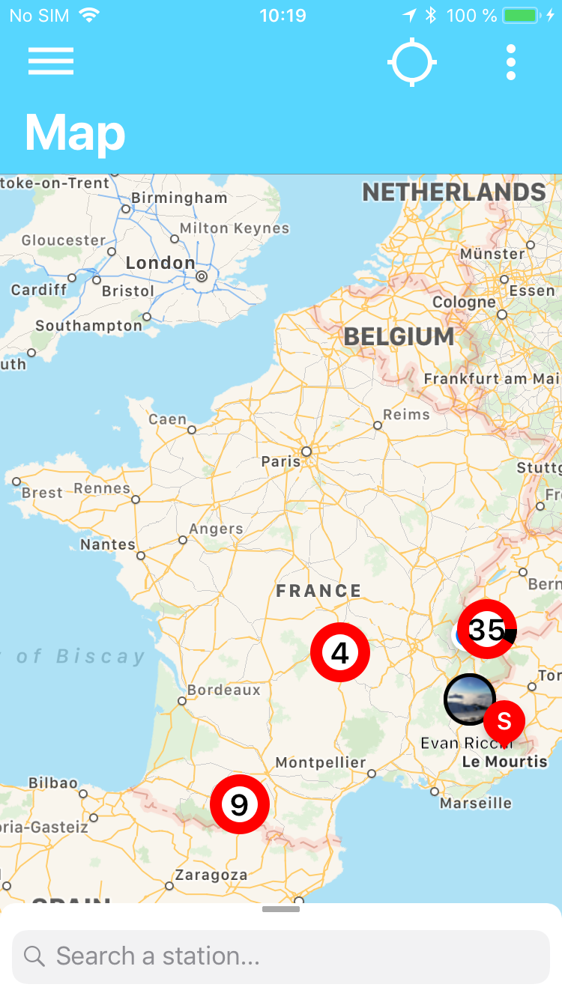
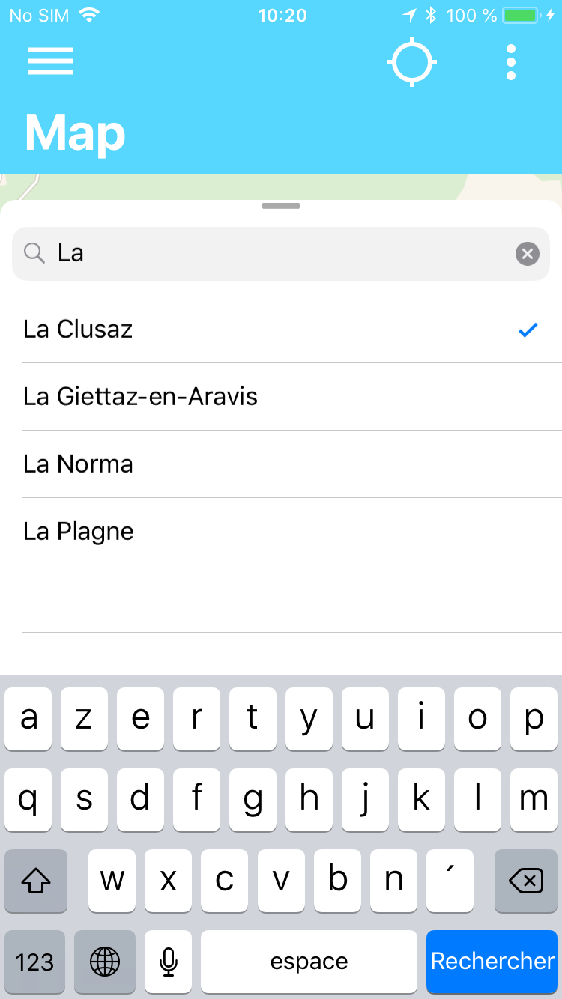
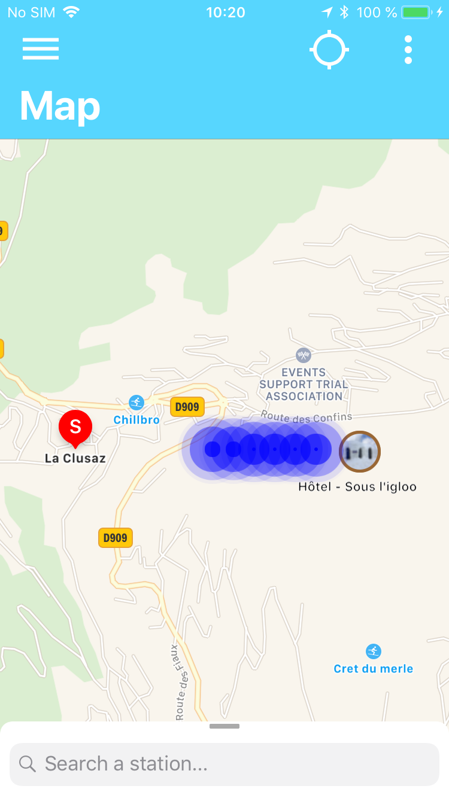
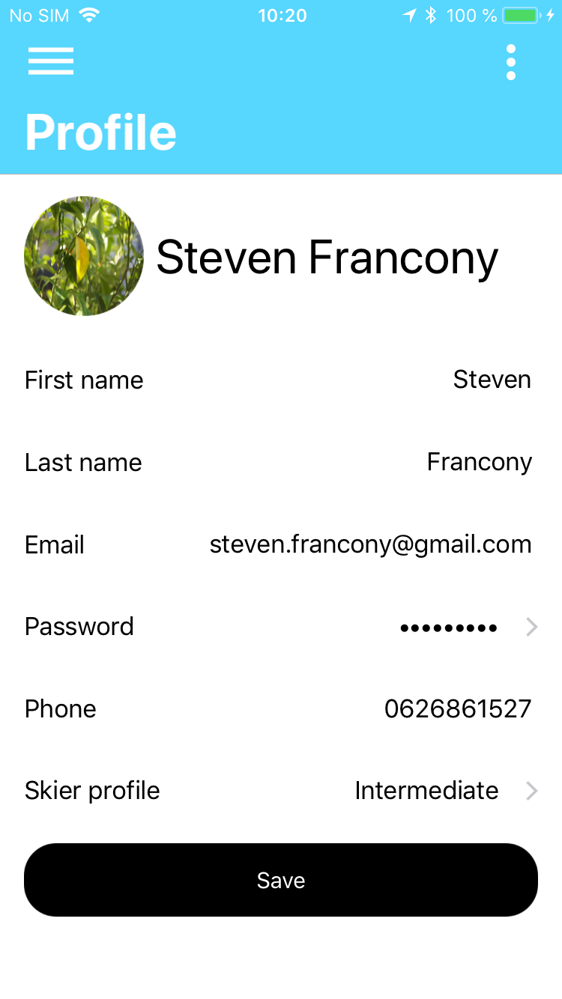

# Snow IO
> IOS application prototype realized during my year of sandwich course (computer developer license).

[![Swift Version][swift-image-4]][swift-url]
[](https://travis-ci.org/WestFR/SnowIO-iOS)
[![Sonar Cloud][sonar-image]][sonar-url]
[![License][license-image]][license-url]


This application was developed as part of my final exam during this training.
The latter was developed entirely by myself.

The purpose of this application is to simplify the life of a skier by offering them the visualization of information on the chosen station.

It allows to find points of interest or challenges to achieve the different ski slopes on the chosen resort.

This application uses a database to work.

This application requires a network connection to work. It does not collect any personal information.

       


## Features

- [x] Network codebase work with protocol / datasources pattern
- [x] SearchController / BottomSearchView
- [x] MapKitView with custom annotation
- [x] ExpendableListView / CustomTableViews
- [x] Sleek Design
- [x] Ready to Publish
- [x] About page examples with Alert
- [x] 2 languages : French, English


## Testings

- [x] Connected to Travis CI/CD
- [x] Code scan with SonarCloud 


## Requirements

- iOS 11.0+
- Xcode 9.4+
- Need to link the app with Firebase for correct operation of the application : https://firebase.google.com/


## Installation

1. Clone this project in your project folder : `git clone https://github.com/WestFR/SnowIO-iOS`

2. If you want costumize URL, see again 'AppDelegate.swift' class :
```
static let APP_STORE_URL = ""
static let APP_PAGE_URL = "http://emilienleroy.fr/crystal/"
```

3. Go to FIREBASE website and follow instructions for connect your app to your console project : https://firebase.google.com/

4.Enable authentication via email / password using Firebase menus.

5. Add this file on your FIREBASE database :  https://github.com/WestFR/SnowIO-iOS/blob/master/informations/data_test.json

6. Add this code on your FIREBASE database rules : 
```
{
  "rules": {
    ".read": true,
    ".write": true,
    "users": {
      ".read": true,
      ".write": true,
      ".indexOn": ["email","firstname","lastname"]
    },
    "stations": {
      ".read": true,
      ".write": true,
      ".indexOn": "name"
    },
    "skiSlope": {
      ".read": true,
      ".write": true,
      ".indexOn": ["idStation","name"]
    }
  }
}
```

7. Now, you can build and run this application and develop your functions !


## Contribute

We would love you for the contribution to ``SnowIO-iOS`` project, check the ``LICENSE`` file for more info.


## Meta

Distributed under the MIT license. See ``LICENSE`` for more information.


[swift-image-4]:https://img.shields.io/badge/swift-4.0-orange.svg
[swift-url]: https://swift.org/

[sonar-image]: https://sonarcloud.io/api/project_badges/measure?project=SnowIO-iOS&metric=alert_status
[sonar-url]: https://sonarcloud.io/dashboard?id=SnowIO-iOS

[license-image]: https://img.shields.io/badge/License-MIT-blue.svg
[license-url]: LICENSE